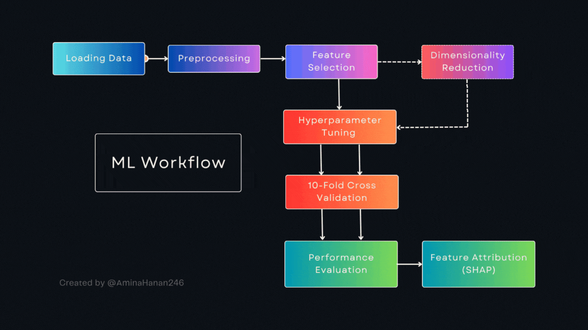

# Machine Learning For Biomarker Discovery for Alzheimer's Disease

This repository contains a complete machine learning workflow for biomarker discovery, from raw gene expression data to identifying genes as potential biomarkers. The project demonstrates pre-processing, feature scaling, dimensionality reduction, hyperparameter tuning, cross-validation, and feature attribution (SHAP) using Python. The project was done as part of internship "ML for Biomarker Discovery" by NyBerMan Bioinformatics

---

## Project Overview

The goal of this project is to identify potential biomarkers from gene expression data. The workflow includes:



---

## Folder Structure
```
ML_alzheimer_gene_/
├── scripts/            # Analysis scripts (Python)
├── results/            # Evaluation performance data
├── plots/              # Distribution plots, PCA plots, confusion matrix
└── README.md           # Project documentation
```
---
## Introduction
Alzheimer’s disease (AD) is a complex neurodegenerative disorder whose early detection remains a major challenge. With the growing availability of high-dimensional gene expression datasets, machine learning (ML) offers a way to uncover predictive biomarkers and model disease signatures that go beyond traditional single-gene analysis.
The project applies ML techniques to differentiate Alzheimer's patients from controls by identify key genes, using supervised classification and feature attribution

## Data Overview
The dataset contains 206 samples with 19,297 genes, label and batch. The target variable is 'label' which have classes 'control' and 'condition'. The class distribution was balanced and therefore did not need any pre-processing

## Data Pre-processing
The 'batch' columns was dropped as it did not provide any relevant information. The target variable was label encoded to `Control -> 0` and `Condition -> 1` using the map function. The data was then train-test split to 80:20 ratio

## PCA experiment
A dimensionality reduction was performed in order to check its affect on model performance. PCA applied to retain >= 95% variance which was explained by 213 principal components.
The PCA caused a drop in model accuracy, and therefore confirmed that the original features had better discriminative power. Thus, final analyses used raw data.

## Model Training
Among all the models performance, three models which performed - worst, mid and best was chosen. These model were **Logistic Regression**, **Random Forest Classifier**, and **XGBoost Classifier**. Each model was trained with both PCA and non-PCA data, hyperparameter tuning performed via `RandomizedSearchCV` using training set and cross-validated using `10-fold Stratified cross-validation` using the entire dataset 

## Model Evaluation
Metric such as **Accuracy**, **Precision**, **Recall**, **F1-score** and **ROC-AUC** was evaluated for each model, with *Accuracy* given priority after hyperparameter tuning and cross-validation. There was 5-6% reduction in accuracy during cross-validation, which was expected and also indicates that the model didn't overfit the training data. 
From these evaluation, the model with best performance was:
> XGBoost, Accuracy = 94.43 ± 3.86%, ROC–AUC = 0.995 ± 0.0254

## Feature Attribution
Key genes involved in predictive power of samples were identified using **SHAP** (SHapley Additive exPlanations). The top contributing genes were *APP*, *APOE* and *PSEN1* which are AD biomarkers involved in amyloid pre-processing and lipid metabolism.

## Conclusion
The project concludes XGBoost as the most robust classifier for this dataset. While PCA helps in reducing the number of features involved, much of the information with important discriminative power is lost.
Key genes as potential biomarker's for Alzheimer's Disease was also identified. Thus, demonstrates that machine learning techniques can be used reveal biological insights.

---

## Tools and Libraries
* Python 3.10+
* scikit-learn
* XGBoost
* SHAP
* pandas, numpy
* matplotlib, seaborn
* joblib
