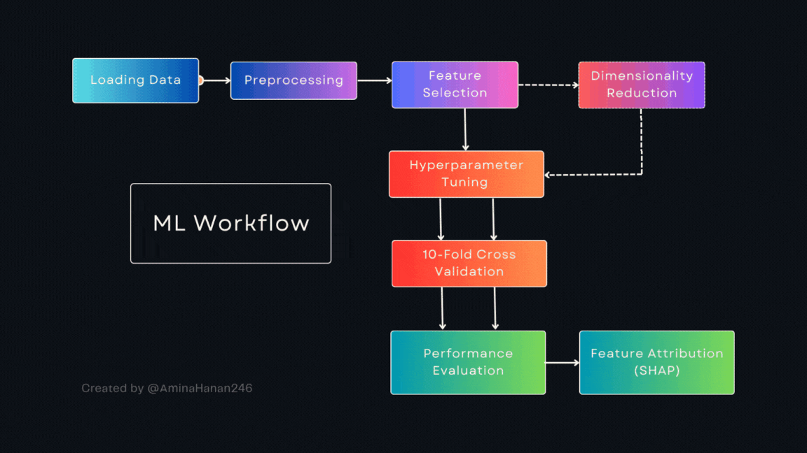
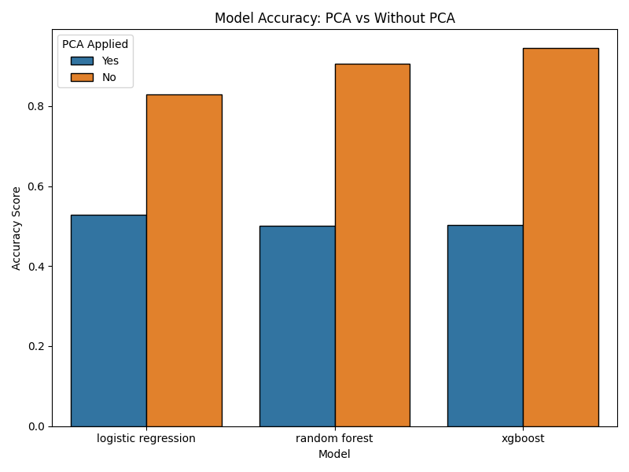
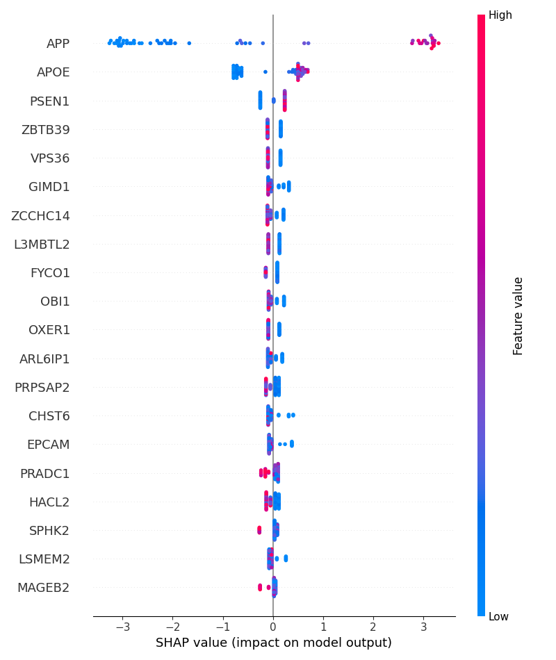

# Machine Learning For Biomarker Discovery for Alzheimer's Disease

This repository contains a complete machine learning workflow for biomarker discovery, from raw gene expression data to identifying genes as potential biomarkers. The project demonstrates pre-processing, feature scaling, dimensionality reduction, hyperparameter tuning, cross-validation, and feature attribution (SHAP) using Python. 

---

## Project Overview

The goal of this project is to identify potential biomarkers from gene expression data. The workflow includes:



**Clinical Relevance:** Top biomarkers (APP, APOE, PSEN1) align with known AD mechanisms involving amyloid processing and lipid metabolism, validating model's biological interpretability.
---

## Folder Structure
```
ML_alzheimer_gene_/
├── scripts/            # Analysis scripts (Python)
├── results/            # Evaluation performance data
├── plots/              # Distribution plots, PCA plots, confusion matrix
├── config.yml          # configuration file
└── README.md           # Project documentation
```
---
## Data Overview
Samples: 206 (control vs. condition)
Features: 19,297 genes (RNA-seq expression values)

## Data Pre-processing
- Samples were balanced and did not need resampling
 
- Removed batch ID column (no batch effect detected)
- Label encoding: Control → 0, Condition → 1
- Train-test split: 80/20 stratified by class

# Methodology
## Dimensionality Reduction: PCA vs. Raw Features
Compared model performance with/without PCA (95% variance = 213 components)

| Experiment           | XGBoost Accuracy       | Random Forest         | Logistic Regression   | 
|----------------------|------------------------|-----------------------|-----------------------|
| Raw Features         | 96.55%                 |  93.10%               |  80.70%               |
| PCA-performed        | 60.34%                 |  60.33%               |  46.62%               |

 

- 36% reduced accuracy with PCA
- Raw features preserve biological interpretations
**Proceeded with raw features**

## Model Selection & Optimization
From different ML models, 3 models were selected based on accuracy - worst, mid and best
**Model selected:** Logistic Regression, Random Forest, XGBoost
**Optimisation:** RandomizedSearchCV with 5-fold CV (accuracy metric)
**Final Evaluation (10-fold Stratified CV on entire dataset)*
| Model                | Accuracy               | Precision             | F1 Score              | ROC-AUC               | 
|----------------------|------------------------|-----------------------|-----------------------|-----------------------|
| XGBoost              | 94.43 ± 3.86%          |  98.75 ± 3.75%        |  94.10 ± 4.13%        |  0.995 ± 0.025        |
| Random Forest        | 89.53 ± 4.37%          |  93.13 ± 5.63%        |  88.64 ± 5.04%        |  0.974 ± 0.014        |
| Logistic Regression  | 80.70 ± 6.88%          |  83.23 ± 5.72%        |  82.00 ± 6.47%        |  0.867 ± 0.068        |

**Best Model:** XGBoost
- Best accuracy and stability (lowest variance)
- Compatible with SHAP for feature importance analysis
 

## Biomarker Discovery: SHAP Feature Attribution
SHAP (SHapley Additive exPlanations) reveals:
- Individual gene contribution
- Regulation of gene; upregulated or downregulated
- Based on gene interaction where contribution are measured.
 

## Conclusion
The project concludes XGBoost as the most robust classifier for this dataset. While PCA helps in reducing the number of features involved, much of the information with important discriminative power is lost.
Key genes as potential biomarker's for Alzheimer's Disease was also identified. Thus, demonstrates that machine learning techniques can be used reveal biological insights.

---

## Tools and Libraries
* Python 3.10+
* scikit-learn
* XGBoost
* SHAP
* pandas, numpy
* matplotlib, seaborn
* joblib
